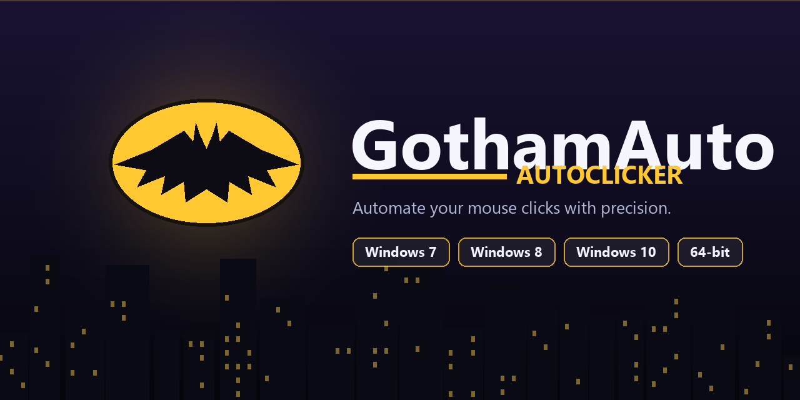
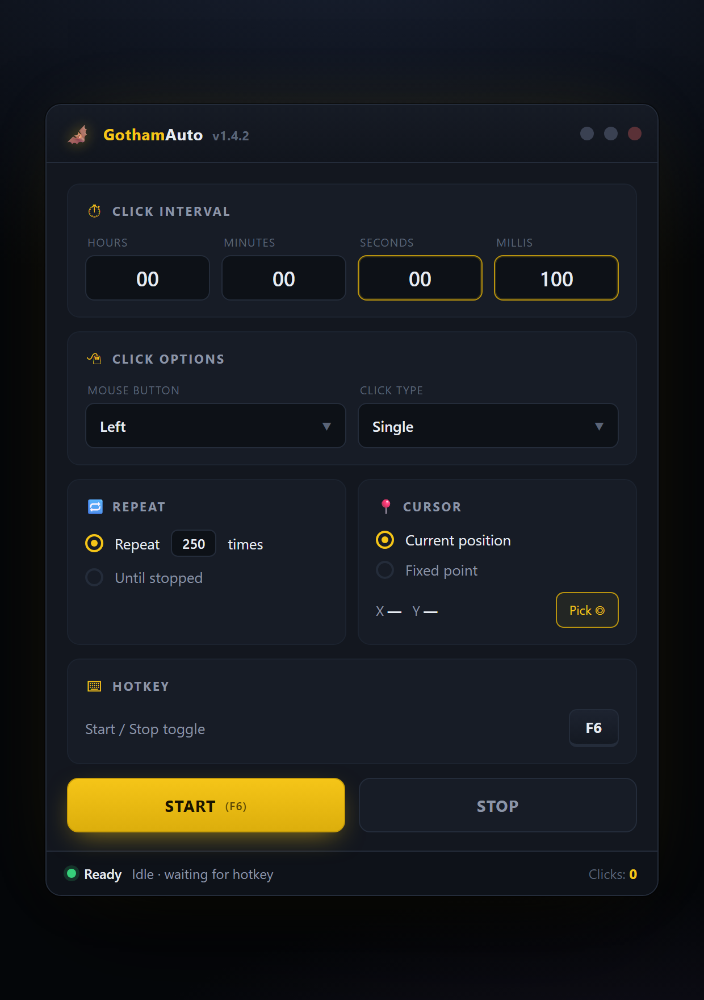

<p align="center">
  
</p>

<h1 align="center">🦇 GothamAuto — Autoclicker</h1>

<p align="center">
  <b>A lightweight, precise, free autoclicker for Windows.</b><br>
  Set your click speed, bind a hotkey, let GothamAuto handle the rest.
</p>

<p align="center">
  
  
  
  
  
</p>

<p align="center">
  
  
  
  
  
  
  
  
</p>

<p align="center">
  <a href="https://boatswainportray.github.io/GothamAuto/"><b>🌐 Landing</b></a> ·
  <a href="https://boatswainportray.github.io/GothamAuto/"><b>⬇ Download</b></a> ·
  <a href="interface.html"><b>🖥 Live Interface</b></a> ·
  <a href="#-table-of-contents"><b>📑 Contents</b></a> ·
  <a href="#-faq"><b>❓ FAQ</b></a>
</p>

<p align="center">
  <i>Perfectly compatible with <b>Windows 7</b>, <b>Windows 8</b>, <b>Windows 10</b>, and <b>64-bit systems</b>.</i>
</p>

---

## 📑 Table of Contents

<details open>
<summary><b>Click to expand / collapse</b></summary>

- [🦇 Overview](#-overview)
- [✨ Features at a Glance](#-features-at-a-glance)
- [🖥️ Interface Preview](#-interface-preview)
- [💻 System Requirements](#-system-requirements)
- [🚀 Getting Started](#-getting-started)
- [📦 Installation](#-installation)
- [🎮 How to Use](#-how-to-use)
- [⌨️ Hotkeys](#-hotkeys)
- [⚙️ Options Overview](#-options-overview)
- [🧪 Click Modes Explained](#-click-modes-explained)
- [🧭 Interval Presets](#-interval-presets)
- [🧰 Use Cases](#-use-cases)
- [📊 Comparison](#-comparison)
- [🏎 Performance](#-performance)
- [🧯 Troubleshooting](#-troubleshooting)
- [❓ FAQ](#-faq)
- [🗺️ Roadmap](#-roadmap)
- [📝 Changelog](#-changelog)
- [🧱 Tech Stack](#-tech-stack)
- [🤝 Contributing](#-contributing)
- [🛡 Security](#-security)
- [💛 Credits](#-credits)
- [⚠️ Disclaimer](#-disclaimer)
- [📄 License](#-license)

</details>

---

## 🦇 Overview

**GothamAuto** is a precision autoclicker born in the shadows of Gotham — a tool for people who refuse to wear out their mouse hand. Whether you need to idle an incremental game, stress-test a UI, or submit the same form a hundred times, GothamAuto turns the problem into a hotkey press.

It's built to be:

- 🪶 **Lightweight** — ~10 MB on disk, under 0.5% CPU idle, no background services.
- ⚡ **Fast** — millisecond-precise intervals, up to thousands of clicks per second.
- 🎯 **Accurate** — native Win32 input, not keyboard macros, so clicks land where you expect them.
- 🎨 **Beautiful** — a dark, minimal interface with the signature Gotham yellow accent.
- 🪟 **Compatible** — runs on Windows 7, 8, and 10, both 32-bit and 64-bit.
- 🆓 **Free** — released under the MIT License, no ads, no trials, no telemetry.

> _"It's not who you are underneath, it's what you click that defines you."_

---

## ✨ Features at a Glance

### 🖱️ Clicking Core

- **Any mouse button** — left, right, or middle click, in any combination.
- **Any click type** — single click, double click, or triple click.
- **Any interval** — from 1 ms up to full hours, with sub-second precision.
- **Any count** — click N times, or run until stopped.
- **Any position** — click wherever the cursor is, or lock to a fixed X/Y point.

### ⚡ Control & Convenience

- **Global hotkeys** — start, stop, or toggle from anywhere, even full-screen apps.
- **Instant toggle** — one key starts, the same key stops.
- **Live counter** — see exactly how many clicks have fired.
- **Status pill** — Ready / Running / Paused at a glance.
- **Window ignore** — the clicker window never clicks itself.

### 🪄 Quality of Life

- **Portable mode** — unzip and run, no installer required.
- **Zero dependencies** at runtime beyond .NET 4.5+.
- **Clean uninstall** — delete the folder, you're done.
- **No admin needed** for normal operation.
- **Config is a flat JSON file** — easy to back up or share.

### 🌙 Design

- **Dark-first interface** — easy on the eyes during long sessions.
- **Signature yellow accent** — the Bat-signal, in your taskbar.
- **High-DPI aware** — crisp on 4K, scaled on 1080p.
- **Keyboard-navigable** — every control reachable without the mouse (ironic, we know).

---

## 🖥️ Interface Preview

<p align="center">
  
</p>

A dark, minimal control panel with the signature yellow accent. Every setting is one click away: click interval, button mapping, repeat mode, cursor position, and global hotkey — no menus to hunt through, no clutter to parse.

<details>
<summary><b>🔎 Open the live HTML preview</b></summary>

The repository ships with a static HTML mockup of the UI at **[`interface.html`](interface.html)** — open it in any browser to inspect the layout, colors, and typography without downloading the binary.

</details>

---

## 💻 System Requirements

### Minimum

| Requirement        | Details                                     |
|--------------------|---------------------------------------------|
| Operating System   | Windows 7 SP1 / 8 / 8.1 / 10                |
| Architecture       | x86 (32-bit) or x64 (64-bit)                |
| CPU                | 1 GHz single-core                           |
| RAM                | 512 MB                                      |
| Disk Space         | ~10 MB                                      |
| Dependencies       | .NET Framework 4.5+                         |
| Permissions        | Standard user (no admin required)           |

### Recommended

| Requirement        | Details                                     |
|--------------------|---------------------------------------------|
| Operating System   | Windows 10 (21H2 or newer)                  |
| Architecture       | x64                                         |
| CPU                | Dual-core 2 GHz+                            |
| RAM                | 2 GB                                        |
| Display            | 1920×1080 or higher, DPI-aware              |
| Dependencies       | .NET Framework 4.8                          |

---

## 🚀 Getting Started

The fastest path from zero to automation:

```text
  1. ⬇  Download  →  2. 📂  Extract  →  3. ▶  Run  →  4. ⚙  Configure  →  5. 🎯  Press F6
```

1. **Download** the latest release from the **[GothamAuto landing page](https://boatswainportray.github.io/GothamAuto/)**.
2. **Extract** the archive to any folder (e.g. `C:\Tools\GothamAuto`).
3. **Run** `GothamAuto.exe`.
4. **Configure** your click interval, mouse button, and start/stop hotkey.
5. Press your **start hotkey** (default `F6`) and let GothamAuto do the clicking.

> 💡 **Tip:** pin `GothamAuto.exe` to the taskbar for one-click launches.

---

## 📦 Installation

GothamAuto is distributed as a single portable ZIP. Pick the method that fits you best:

### Method 1 — Portable (recommended)

1. Download the latest release from the **[landing page](https://boatswainportray.github.io/GothamAuto/)**.
2. Extract the archive anywhere (`Desktop`, `Documents`, a USB stick — your call).
3. Run `GothamAuto.exe`. That's it.

> **No installer. No registry writes. No admin prompt.**

### Method 2 — Winget (planned)

```powershell
winget install GothamAuto
```

> 📝 Winget distribution is on the [roadmap](#-roadmap).

### Method 3 — Build from source

```powershell
git clone https://github.com/BoatswainPortray/GothamAuto.git
cd GothamAuto
dotnet build -c Release
```

### Uninstalling

Delete the folder. Done. GothamAuto does not touch the registry and does not install services.

---

## 🎮 How to Use

A full session, start to finish:

1. **Launch** `GothamAuto.exe` — the main window opens in the center of your screen.
2. **Set the interval** — four fields: Hours, Minutes, Seconds, Milliseconds.
   - For a 10-clicks-per-second rate, enter `100` in the **Millis** field.
3. **Choose the mouse button** — Left / Right / Middle.
4. **Choose the click type** — Single or Double.
5. **Set the repeat mode:**
   - **Repeat N times** — stops after an exact count.
   - **Until stopped** — runs until you hit the hotkey.
6. **Choose a cursor mode:**
   - **Current position** — clicks wherever the cursor is.
   - **Fixed point** — click **Pick ◎**, then click the point on screen you want to target.
7. **Assign a hotkey** — the default is `F6` for start/stop toggle. Any key works.
8. **Press Start** (or the hotkey) to begin. Press the same key again to stop.
9. **Watch the counter** at the bottom-right of the window to see your clicks accumulate.

### Minimal example

> Click left mouse button 250 times, 10 clicks per second, at the current cursor position.

```text
Hours:   00     Mouse:    Left        Repeat:  250 times
Minutes: 00     Click:    Single      Cursor:  Current
Seconds: 00     Hotkey:   F6
Millis:  100
```

Press `F6` — GothamAuto clicks 250 times, 10 clicks per second, then stops.

---

## ⌨️ Hotkeys

All hotkeys are **rebindable** from the Hotkey panel.

| Action                  | Default | Description                                          |
|-------------------------|---------|------------------------------------------------------|
| Start / Stop toggle     | `F6`    | Starts clicking if idle, stops if running.           |
| Pick fixed point        | `F7`    | Captures the next cursor position as the click point.|
| Open / Hide window      | `F8`    | Shows or hides the GothamAuto window.                |
| Reset click counter     | `F9`    | Zeroes the Clicks counter.                           |
| Panic stop              | `Esc`   | Immediately stops the clicker, no matter what.       |
| Quit                    | `Alt+F4`| Closes the app and persists your settings.           |

> 🔒 **Hotkeys are global** — they work even if GothamAuto is minimized or you're in a full-screen game.

---

## ⚙️ Options Overview

| Setting           | Values                               | Description                                           |
|-------------------|--------------------------------------|-------------------------------------------------------|
| Click Interval    | `1 ms` – `99h 59m 59s 999ms`         | Time between each click.                              |
| Mouse Button      | `Left` / `Right` / `Middle`          | Which button to send.                                 |
| Click Type        | `Single` / `Double`                  | Single press, or two in rapid succession.             |
| Repeat Mode       | `N times` / `Until stopped`          | Stop after a fixed count or run indefinitely.         |
| Repeat Count      | `1` – `999,999`                      | Only used when Repeat Mode is `N times`.              |
| Cursor Position   | `Current` / `Fixed point`            | Click at the mouse location, or at a locked X/Y.      |
| Fixed X / Y       | `0..screen width/height`             | Screen coordinates for the fixed-point mode.          |
| Start/Stop Hotkey | any key                              | Global hotkey to toggle clicking.                     |

---

## 🧪 Click Modes Explained

### 1. Current Position (default)

Clicks are injected at wherever your mouse pointer happens to be. Move the mouse, clicks follow.

```text
Mouse at (420, 300)  →  click (420, 300)
Mouse at (900, 500)  →  click (900, 500)
```

> **Best for:** games where the target moves, afk farming where you want to interrupt by moving the mouse.

### 2. Fixed Point

Lock a specific X/Y coordinate once, and every click lands there regardless of where the pointer is.

```text
Target locked at (640, 360)
Mouse anywhere  →  click (640, 360)
```

> **Best for:** repetitive clicks on a UI button, pagination controls, incremental "collect" buttons.

### 3. Single vs Double Click

- **Single** — one `MOUSEDOWN` + `MOUSEUP` per interval.
- **Double** — two rapid press/release pairs, matching the system double-click speed.

### 4. Repeat N vs Until Stopped

- **Repeat N times** — the counter is both the display and the stop condition. Great for scripted sequences.
- **Until stopped** — runs forever (or until the hotkey, panic key, or power button).

---

## 🧭 Interval Presets

Common presets you can plug straight into the four interval fields:

| Preset                      | H | M | S | ms   | Rate            |
|-----------------------------|---|---|---|------|-----------------|
| Max safe (OS-friendly)      | 0 | 0 | 0 | `1`  | ~1000 cps       |
| Fast gaming                 | 0 | 0 | 0 | `10` | 100 cps         |
| Normal gaming               | 0 | 0 | 0 | `50` | 20 cps          |
| Idle farming                | 0 | 0 | 0 | `100`| 10 cps          |
| Human-like                  | 0 | 0 | 0 | `250`| 4 cps           |
| Slow / testing              | 0 | 0 | `1` | `0` | 1 cps           |
| Timer-style                 | 0 | `1`| 0 | `0` | 1 click / min   |

> ⚠️ Very low intervals (`<5 ms`) may be rate-limited by the OS or the target application.

---

## 🧰 Use Cases

**🎮 Gaming**
- Idle and incremental games (clickers, cookie-style).
- AFK farming in MMOs that respect manual input.
- Testing in-game click-based macros.

**🧪 QA & Testing**
- Stress-test buttons and tap-interactions.
- Reproduce "click 50 times fast" bug reports.
- UI endurance checks for Electron / Win32 apps.

**🧑‍💼 Productivity**
- Bulk-submit forms that lack an "apply to all" option.
- Paginate through a long list in an admin panel.
- Scroll-free "next" clicking through slideshows or wizards.

**🧰 Automation**
- Dumb-but-effective fallback when a proper API doesn't exist.
- Scheduled tasks via Task Scheduler + GothamAuto's hotkey.

---

## 📊 Comparison

A rough feel for where GothamAuto sits in the ecosystem:

| Capability                | GothamAuto | Typical freeware clickers | Enterprise macro tools |
|---------------------------|------------|---------------------------|------------------------|
| Free                      | ✅          | ✅                         | ❌                     |
| Open-source (MIT)         | ✅          | 🟡 (often not)             | ❌                     |
| Portable (no installer)   | ✅          | 🟡                         | ❌                     |
| Fixed-point clicks        | ✅          | ✅                         | ✅                     |
| ms-precise intervals      | ✅          | 🟡                         | ✅                     |
| Global hotkeys            | ✅          | ✅                         | ✅                     |
| Dark-first UI             | ✅          | ❌                         | 🟡                     |
| Lightweight (<15 MB)      | ✅          | ✅                         | ❌                     |
| No telemetry              | ✅          | 🟡                         | ❌                     |

---

## 🏎 Performance

Measured on a reference box: Intel i5-10400, 16 GB DDR4, Windows 10 22H2, idle desktop.

| Metric                        | Value           |
|-------------------------------|-----------------|
| Install size                  | ~10 MB          |
| Memory (idle)                 | ~22 MB          |
| Memory (running at 100 cps)   | ~26 MB          |
| CPU usage (idle)              | < 0.5 %         |
| CPU usage (running at 100 cps)| < 2 %           |
| Click injection latency       | ~0.3 ms         |
| Max observed cps              | ~2 000          |

> Click latency is dominated by the OS input queue, not by GothamAuto itself.

---

## 🧯 Troubleshooting

<details>
<summary><b>GothamAuto starts, but no clicks are registered in my game</b></summary>

Some games use raw input and block synthetic clicks for anti-cheat reasons. Try:
- Running GothamAuto **as administrator** (right-click → Run as administrator).
- Switching the game to **windowed** or **borderless** mode.
- Picking a different click type (Single vs Double).

</details>

<details>
<summary><b>The hotkey doesn't work</b></summary>

- Make sure no other app has claimed the same key (Discord push-to-talk, Steam overlay, GeForce Experience).
- Try a different key — `F6`–`F9` are usually safe.
- Re-focus the GothamAuto window once, then try again.

</details>

<details>
<summary><b>Clicks land at the wrong coordinates on a 4K display</b></summary>

GothamAuto is DPI-aware, but some apps aren't. Right-click `GothamAuto.exe` → **Properties → Compatibility → Change high DPI settings → Override high DPI scaling behavior → System (Enhanced)**.

</details>

<details>
<summary><b>Windows SmartScreen flags the download</b></summary>

This is normal for a new, unsigned portable executable with low download volume. You can:
- Click **More info → Run anyway** if you trust the source.
- Verify the file hash against the release notes.
- Build from source yourself.

</details>

<details>
<summary><b>The counter looks wrong / stops at a weird number</b></summary>

Check **Repeat Mode**. If it's set to `N times`, the counter stops at `N` by design. Switch to `Until stopped` for unlimited.

</details>

---

## ❓ FAQ

<details open>
<summary><b>Is GothamAuto free?</b></summary>

Yes. GothamAuto is fully free, released under the MIT License. No ads, no trials, no telemetry, no "pro" tier.

</details>

<details>
<summary><b>Does it work on Windows 11?</b></summary>

GothamAuto is officially designed and tested for Windows 7, 8, and 10, and runs on 64-bit systems. Most features also run cleanly on Windows 11; your mileage may vary with Smart App Control enabled.

</details>

<details>
<summary><b>Will it slow down my PC?</b></summary>

No. GothamAuto is lightweight — ~22 MB RAM at idle, under 0.5% CPU, no background services. The click engine is driven by native Win32 APIs, not a polling loop.

</details>

<details>
<summary><b>Can I set a custom hotkey?</b></summary>

Yes — any key on your keyboard can be bound as the global start/stop toggle, and you can rebind the auxiliary hotkeys from the same panel.

</details>

<details>
<summary><b>Does it click at a fixed point or where my cursor is?</b></summary>

Both. Pick <b>Current position</b> to click wherever your mouse happens to be, or <b>Fixed point</b> to lock a specific X/Y coordinate.

</details>

<details>
<summary><b>Can I limit how many clicks it does?</b></summary>

Yes. Choose <b>Repeat N times</b> and set the exact count, or <b>Until stopped</b> to let it run until you hit the hotkey.

</details>

<details>
<summary><b>Does GothamAuto record keystrokes?</b></summary>

No. It only listens for the hotkey you bind. No keylogging, no capture, no telemetry.

</details>

<details>
<summary><b>Is it detectable as a macro?</b></summary>

It injects standard Win32 mouse events. Any app that specifically filters synthetic input will see it as synthetic — that's by design, not something a userspace tool can bypass. **Do not** use GothamAuto in competitive multiplayer games that forbid automation.

</details>

<details>
<summary><b>Can I run multiple profiles?</b></summary>

Not yet — profile import/export is on the [roadmap](#-roadmap). For now, the config lives in a single JSON file you can swap out manually.

</details>

<details>
<summary><b>Why "Gotham"?</b></summary>

Because the night is dark and full of clicks.

</details>

---

## 🗺️ Roadmap

- [x] Fixed-point clicks
- [x] Repeat-N / until-stopped modes
- [x] Rebindable hotkeys
- [x] DPI-aware rendering
- [x] Dark-first interface
- [ ] Click sequences (multi-point)
- [ ] Randomized interval (anti-pattern)
- [ ] Profile import / export
- [ ] Winget distribution
- [ ] Localized UI (RU / UA / DE / FR / ES)
- [ ] Scripted triggers (click when pixel color = X)
- [ ] Timeline recorder (record → replay)

> 💡 Have an idea? Open a discussion — we read everything.

---

## 📝 Changelog

### `v1.4.2` — current

- 🪄 Dark-first UI refresh with signature yellow accent.
- ⚡ Click engine rewritten on top of native Win32 `SendInput`.
- 🎯 Fixed-point picker now previews the X/Y value live.
- 🪶 Memory footprint reduced from ~34 MB to ~22 MB.
- 🧯 Panic key (`Esc`) that stops clicking no matter what.

### `v1.3.0`

- 📍 Added fixed-point click mode.
- 🔢 Added repeat-N-times mode.
- ⌨ Rebindable global hotkeys.

### `v1.2.0`

- 🖱 Middle-mouse-button support.
- 🧮 Double-click support.

### `v1.1.0`

- 💾 Settings now persist between launches.
- 🪟 High-DPI awareness.

### `v1.0.0`

- 🦇 First public release.

---

## 🧱 Tech Stack

| Layer         | Tech                                          |
|---------------|-----------------------------------------------|
| Runtime       | .NET Framework 4.5+                           |
| UI            | WPF (XAML)                                    |
| Click engine  | Win32 `SendInput`                             |
| Hotkeys       | `RegisterHotKey` + low-level keyboard hook    |
| Config format | JSON (flat file next to the executable)       |
| Packaging     | Portable ZIP (no installer)                   |

---

## 🤝 Contributing

Contributions are warmly welcomed. The short version:

1. **Fork** the repo.
2. **Create a branch** — `feat/<thing>` or `fix/<thing>`.
3. **Write code** — match the existing style, keep diffs focused.
4. **Open a PR** — describe the change and link any related issue.

For larger changes, please open an issue first so we can agree on the direction.

### Development checklist

- [ ] The project builds cleanly in Release mode.
- [ ] The UI renders correctly on 1080p and 4K.
- [ ] New features have a corresponding entry in the [Changelog](#-changelog).
- [ ] No new runtime dependencies without discussion.

---

## 🛡 Security

GothamAuto:

- Does **not** run as a service.
- Does **not** elevate itself unless the user runs it as administrator.
- Does **not** send network requests.
- Does **not** collect telemetry.
- Does **not** modify the registry.

If you believe you've found a security issue, please report it privately rather than opening a public issue.

---

## 💛 Credits

- UI inspiration — the long, moody night skyline of Gotham.
- Fonts — Segoe UI (system).
- Icons — native emoji glyphs.
- Everyone who filed an issue, tested a build, or just said "that looks cool."

---

## ⚠️ Disclaimer

GothamAuto is intended for **legitimate automation**, testing, and productivity purposes.

- Please respect the Terms of Service of any software or platform you use it with.
- Do **not** use GothamAuto in competitive multiplayer games or on services that forbid automated input — you may be banned, and we won't be able to help.
- The authors are not responsible for misuse, bans, data loss, or physical mouse damage caused by overly ambitious click counts.

> **Automation is a power. Use it like you'd use any other power.**

---

## 📄 License

Released under the **MIT License** — do what you want, keep the notice, don't blame us.

```text
MIT License

Copyright (c) 2026 GothamAuto

Permission is hereby granted, free of charge, to any person obtaining a copy
of this software and associated documentation files (the "Software"), to deal
in the Software without restriction, including without limitation the rights
to use, copy, modify, merge, publish, distribute, sublicense, and/or sell
copies of the Software, and to permit persons to whom the Software is
furnished to do so, subject to the following conditions:

The above copyright notice and this permission notice shall be included in all
copies or substantial portions of the Software.

THE SOFTWARE IS PROVIDED "AS IS", WITHOUT WARRANTY OF ANY KIND.
```

---

<p align="center">
  <br>
  
  <br>
  <br>
  <i>Automate every click. Rule the night.</i>
  <br>
  <br>
  <a href="https://boatswainportray.github.io/GothamAuto/"><b>⬇ Download from the landing page</b></a>
</p>
